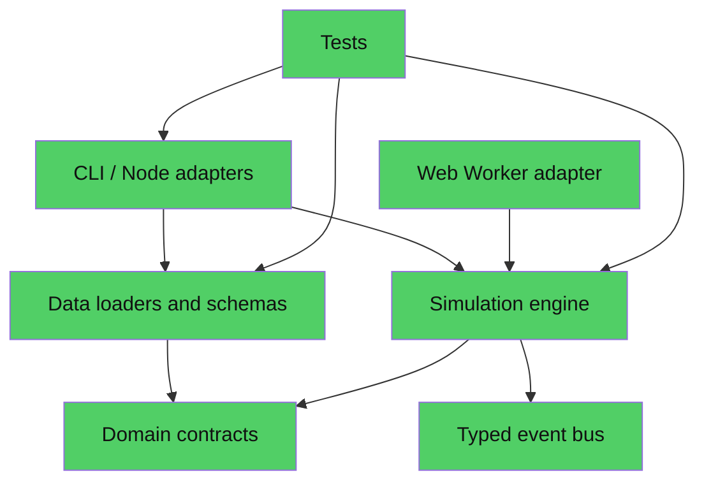

# Plan de Fase 1 — Carrera de diputado

## Estado de entrada

Fase 0 está implementada y sus 12 pruebas, las compilaciones Node/Worker y 1.000 corridas de 20 años pasan. La Fase 1 añadirá la primera carrera de extremo a extremo sobre ese motor. La fuente de verdad es `MANDATO — Documento guía de diseño y construcción.md`; las fases son gates de calidad y el objetivo activo es continuo.

## Estado de ejecución

La implementación actual contiene: creador de personaje en seis pasos; campaña de cuatro semanas con dos acciones por semana; nominación ficticia; elección por distrito/cámara con asignación proporcional D'Hondt (mayoría simple si el país define método mayoritario) y competencia simulada por apoyo individual; cierre por victoria o derrota; reemplazo de un asiento NPC por el personaje; legislatura de 16 turnos con propuestas y voto individual; negociación y ruptura de acuerdos con costos/recuerdo; cobro de promesas en el turno ocho; tres arcos que disparan sus pasos; 27 eventos con tres variantes; 20 formatos titulares alimentados solo por hechos de la partida; bandeja, congreso filtrable, país, prensa, guardado IndexedDB, importación y exportación.

Datos del personaje, la campaña, el parlamento generado y sus eventos están en `CareerGameState` (esquema 3). El estado conserva por separado `countryDataVersion` y `contentDataVersion`. En un mandato, cada avance trimestral llama el motor existente, así economía, ánimo y aprobación avanzan junto al Congreso. La candidatura reemplaza una plaza de la cámara del juego y el voto del jugador cuenta como un voto individual.

Verificación cerrada: `npm test` (19 pruebas), `npm run build`, `npm run build:worker-check` y `tests/web-smoke.py` (flujo de seis pasos, campaña, elección, voto, recarga de guardado y exportación/importación). `npm run validate:career` corrió 1.000 partidas por estrategia: 868/1.000 ganaron con trabajo territorial (86,8%) y completaron el mandato; 0/1.000 ganaron con recaudación sin contacto de campo. Las 868 legislaturas terminaron sus 16 turnos; se aprobó el 36,41% de propuestas. La medición no encontró mayorías de partido único y aún no modela coaliciones. Detalles y limitaciones en `docs/phase-1-report.md`.

## Auditoría de arquitectura existente (skill `brooks-audit`)

**Mode:** Architecture Audit  
**Scope:** `src/domain`, `src/data`, `src/engine`, `src/worker`, `src/cli`, `tests`  
**Config:** No se encontró `.brooks-lint.yaml`; se usaron valores por defecto.  
**Health Score:** 99/100

El motor y las fronteras están separados de la interfaz, y el dominio no depende de Node. El principal riesgo de cambio para la Fase 1 es que el estado de partida y su esquema se serializan como una sola raíz.

### Module Dependency Graph

**Suggestion — State-root change propagation (R2).** `GameState` flows through engine messages, save validation, CLI validation and tests. Adding campaign, character, promises and legislature state directly to that root would make unrelated features change together. Consequence: each Fase 1 feature increases the blast radius of every save and turn change. Remedy: keep the existing deterministic economic `GameState` as a module state and add a composed, versioned `CareerGameState` with named `player`, `campaign`, `legislature`, `inbox` and `clock` sections; the application layer owns composition and commands.

Testability seams: pure seeded rules and the Worker request boundary already exist. The new IndexedDB and browser routing code will sit behind injectable adapters. Conway check: the project is a single-developer repo; no multi-team mismatch is evidenced.

## Arquitectura y carpetas

- `src/domain`: contratos de campaña, personaje, elección, legislatura, promesas, relaciones, bandeja y guardado.
- `src/application`: comandos deterministas y consultas/vistas para iniciar una partida, ejecutar acciones, resolver elección, tramitar decisiones, negociar, votar y avanzar turnos.
- `src/engine/modules`: conserva los sistemas Fase 0; añade reglas de campaña, elección, congreso, memoria, eventos y ritmo como módulos conectados por mensajes tipados.
- `src/data`: esquemas y loaders para país, contenido de juego y plantillas de eventos.
- `src/persistence`: adaptador IndexedDB, rotación de guardados y exportar/importar JSON.
- `src/web`: entrada Vite/React, rutas/pantallas, componentes y estilos en español. La UI despacha comandos y renderiza vistas; no calcula consecuencias.
- `data/countries/peru.json`: instituciones, distritos y reglas estructurales con fuentes; ningún dato de partido o legislador real.
- `data/game`: orígenes, profesiones, formación, rasgos, distribución/catálogos generativos y valores base de juego.
- `data/events`: entre 25 y 30 plantillas con variantes, roles, condiciones, opciones, costos, efectos y arcos.
- `tests`: pruebas de reglas, determinismo, contratos, guardado, simulación masiva y flujos UI críticos.

## Esquemas principales

- `Character`: identidad, edad, origen, profesión, formación, ideología (cinco ejes), rasgos, siete atributos de 1–20 y cuatro recursos; imagen desglosada por bloque y libro de favores.
- `PoliticalParty`/`Faction`: entidades ficticias generadas; arquetipo, ideología, apoyo, tesorería, disciplina, afiliación y relación con el personaje.
- `Legislator`: id, nombre ficticio, cámara, distrito, partido/facción, ideología, lealtad, ambición, integridad, precio político, influencia, intereses, memoria y vínculos.
- `CampaignState`: etapa semanal, acciones, distrito, estrategias, recursos, promesas, encuestas agregadas y registro explicable de resultados.
- `ElectionResult`: participación simulada, votos por distrito/lista, umbrales y escaños; determinista y reproducible.
- `LegislatureState`: legislatura de 16–20 turnos, agenda, comisiones, mociones y votaciones individuales con factores explicados.
- `InboxItem`/`EventTemplate`: categoría, disparador/causas, roles, 3+ variantes, opciones, plazo, costo, efectos inmediatos/diferidos, enfriamiento, prioridad y arco.
- `CareerGameState`: `saveSchemaVersion`, versión de país/contenido, semilla y estado compuesto de módulos; importación valida y no ejecuta lógica de negocio.

## Decisiones y razones

1. El estado de la partida contiene identificadores y entidades generadas con semilla; el país guarda solo instituciones y parámetros del mundo.
2. La fase de campaña usa turnos semanales cortos y la legislatura, turnos trimestrales; todas las acciones producen hechos explicables.
3. Perú inicia una campaña simulada con partidos ficticios. No se carga la distribución de la elección de 2026 ni se persiguen resultados coyunturales.
4. Una distribución de escaños por cámara se genera a partir de la configuración ideológica del país usando un método determinista de mayores restos; el ganador del jugador depende de distrito, promesas, campaña y bloques.
5. Las votaciones calculan afinidad con el texto, disciplina y lealtad partidaria, confianza, rencor y recuerdos de traición. Cada legislador muestra los puntos que explican su voto.
6. Los comandos de aplicación reciben el estado y acción, devuelven un nuevo estado/eventos y no consultan hora, red ni globals. IndexedDB es un adaptador reemplazable.
7. El juego funciona localmente como SPA estática y permite continuar tras reload además de exportar/importar guardados JSON versionados.

## Riesgos y mitigaciones

- Alcance amplio: implementar un corte jugable primero, pero conservar todos los criterios Fase 1 y completar las funciones mínimas requeridas.
- Migración de `GameState`: usar `CareerGameState` compuesto y migrador/rechazo claro por versión; preservar pruebas Fase 0.
- Elección superficial: probar dos estrategias con corridas por semillas y mostrar factores de voto.
- Eventos repetidos o texto defectuoso: validador de plantillas, variantes y memoria de cartas mostradas.
- UI acoplada al motor: comandos y view models como única frontera; adaptador de persistencia inyectable.
- Reglas nacionales incompletas: parametrizar requerimientos del cargo y usar solo referencias oficiales estructurales necesarias; supuestos quedan etiquetados.
- No hay preguntas que bloqueen. Los valores de balance son decisiones reversibles guardadas en `data/game`.

## Orden de ejecución

1. Confirmar candidatura/distritos con datos oficiales estructurales y completar ficha nacional versionada.
2. Diseñar contratos de personaje/carrera, comandos, vistas y guardado.
3. Implementar creación de personaje y generación de actores; cubrir determinismo.
4. Implementar precampaña, campaña y elección; validar dos estrategias en lote.
5. Implementar mandato, agenda, negociación y voto por NPC con razones/memoria.
6. Añadir eventos, feed, bandeja, ritmo y pantallas React.
7. Añadir guardado/recarga/exportación/importación e integración Worker.
8. Ejecutar criterios de aceptación uno por uno, corregir y documentar el informe; al cumplir, iniciar Fase 2 automáticamente.
